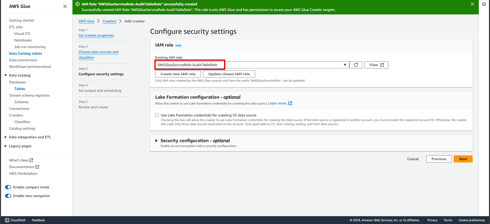

# Audit Table in AWS

The aim of this project is to make an audit table in the context of DynamoDB, which helps us to track changes on records in our database. They are an important tool in our toolbelt to understand the stateful transitions that our records go through. This is important for auditing, debugging, and general understanding of how clients are modifying our records. Here in this project I have created an architecture to set one up with the help of DynamoDB, DynamoDB Streams, Lambda, Kinesis Data Firehose, S3, and Amazon Athena. 

## Application architecture


*From this project the key things I have learnt, how to migrate data from a DynamoDB table into a cold store in S3, and perform SQL queries on it using Athena.*

This project is divided into five parts. Each part describes a scenario of what I'm going to build and step-by-step directions to implement the architecture.

**1. Create a DynamoDB Table**
   
   This DynamoDB table will hold our **'Orders'** information and stores those states of your orders that we want to audit later.

**2. Create a Lambda Function**
   
   This Lambda function will process those orders information from DynamoDB and push it to Kinesis Data Firehose.

**3. Create the DynamoDB Streams Trigger**
   
   Turning on DynamoDB Streams will enable us to get all the events of updation happened on any table item. So, when any order state gets changed, we can have a track later on. This stream will push those info to lambda for further processing.

**4. Create a Kinesis Data Firehose stream and a S3 Bucket**
   
   Kinesis Data Firehose will put those informations through batches into an S3 bucket.

**5. Retrieve Audit Insights using Amazon Athena**
   
   Using Athena we will run SQL queries onto that S3 bucket to get our insights regarding Orders.

## Part 1: Create a DynamoDB Table

Here in this step, the part of the application architecture we focused shown below:


1. Go to the **DynamoDB console**.
2. Start **Create table**, give a **Table name** and a **Partition key** and keep everything default, then **Create table**.


## Part 2: Create a Lambda Function

Here in this step, the part of the application architecture we focused shown below:


1. Go to the **Lambda console**.
2. Start **Create a function**, choose **Author from scratch** and give a **Function name**, select a latest Python **Runtime**.
   


3. Now for the Lambda execution role, we need to create a IAM Role that will have enough permissions for our purpose. Follow the below steps:
   
  IAM Roles and Permission Policies needed to be attached with the lambda function:
  * AmazonKinesisFirehoseFullAccess
  * AWSLambdaBasicExecutionRole
  * DynamoDB: GetRecords
  * DynamoDB: DescribeStream
  * DynamoDB: GetShardIterator
  * DynamoDB: ListStreams

4. Go to **IAM console** and start **Create role**, Select trusted entity as **AWS service** and the service as **Lambda** then **Next**.


5. Find and attach all the permissions mentioned above and then Next. Give a suitable **Role name**, review everything and **Create role**.


6. Now we need to give this role to our lambda, so go back to that lambda console and expand **Change default execution role**, choose to **Use an existing role** and select that role that we just created form the dropdown. Finish the **Create function**.


7. Now **update the code here and Deploy**. Also don't forget to **change the DeliveryStreamName with the Kinesis Data Firehose name** that will create later or you can comeback later after creating the Kinesis Data Firehose and update the code.


## Part 3: Create the DynamoDB Streams Trigger

Here in this step, the part of the application architecture we focused shown below:


1. Go back to the **Orders table** page in the DynamoDB console.
2. Change the tab to **Exports and streams**, scroll below and come to **DynamoDB stream details to Turn on**.


3. Click on **Turn on**, choose **New image** as we want to only get the latest or updated information not the old one. Then Turn on stream.


4. It should show the stream status as On and now triggers are ready to be created. So **Create trigger**, select the **Lambda function** that we created and **choose a preferred Batch size**.


## Part 4: Create a Kinesis Data Firehose stream and a S3 Bucket

Here in this step, the part of the application architecture we focused shown below:


1. Go to the **Amazon S3 console** and create a bucket by putting a **globally unique bucket name** and keep rest of everything as default.
   
  *This will be the bucket where Kinesis Data Firehose will put records to.*


2. Go to the **Amazon Kinesis Data Firehose console** and **Create delivery stream**, choose the **source as Direct PUT** and the **destination as Amazon S3**. Give a **delivery stream name** (this name should be the same name as written inside the lambda code or this name needs to be updated in the lambda code). Now it will ask for the **S3 bucket**, here need to **select the bucket** just created.


## Part 5: Retrieve Audit Insights using Amazon Athena

Here in this step, the part of the application architecture we focused shown below:


Before proceed with this part, we need to add some items inside our DynamoDB table so that we can validate. So to do that, go to that **Orders table page** > **Explore table items** > **Create item** > then **add item values** that you want to add or you can **use JSON**.


This is the JSON I have used, where there are **three fields "orderId" (string), "state" (string) and "lastUpdatedDate" (Number)**

```JSON
{
  "orderId": {
    "S": "101"
  },
  "state": {
    "S": "OPEN"
  },
  "lastUpdatedDate": {
    "N": "1705337067"
  }
}
```


Now after adding this item, you can also try adding different items or try modifying this item by selecting it. I tried with modifying this item and changing its **"state"** from **"OPEN"** to **"PICKEDUP"** and **"DELIVERED"**. So that these events can trigger the DynamoDB Streams and goes through our **Lambda > Kinesis Data Firehose > S3 bucket**.

So to validate that **go to that S3 bucket page** that created earlier, and there you could see some objects were stored inside a **date partitioned folder structure**.


Now as we want to perform analysis on our objects stored inside S3 bucket by running SQL query. We will be needing a schema on which Amazon Athena will run its query. But as S3 is an object storage not a RDBMS, to get a structure or schema out of it, we need to create a AWS glue Crawler that will crawl through our data and learn/generate schema.

Go to **AWS glue console** > Under **Data Catalog** select **Crawlers** and **Add crawler** > **Give it a name, add data source as the S3 bucket and select the S3 bucket** that created earlier and **choose to crawl all sub-folders**.


Next, for the **IAM role** give a **preferred role name** and glue will create the required role for you.



Next, for the target database **create a database under Glue** > **Data catalog** and select that **database**. 


Now **review** everything > **Create crawler** > **Run crawler**.


After running the crawler you should see that **1 table is created with the same name as the S3 bucket**, under **Glue** > **Data catalog** > **Databases** > **Tables**. And inside that there will be the schema that the crawler has detected after crawled through all the objects in S3 bucket.


Now moving on to the Amazon Athena:

1. Go to **Amazon Athena console**.
2. Choose **Analyze your data using PySpark and Spark SQL** and **Launch notebook editor**.


3. Select the **Data source as AwsDataCatalog**, Database as the database you created in Glue Data catalog and there it will show the list of tables. On which you can run your SQL queries and get the results.

As here I am getting all the events that I have done previously on my DynamoDB table item.


Now for final validation, lets edit that **DynamoDB table item** once more and lets check if its coming through our audit query. Go to **DynamoDB console** and in the **Orders table**, modifying the item and changing its **"state"** to **"RETURNED"**.


So, finally you can see all your events are coming from DynamoDB > DynamoDB Streams > Lambda > Kinesis Data Firehose > S3 > Amazon Athena.